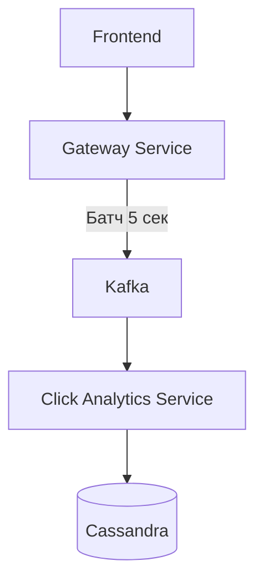
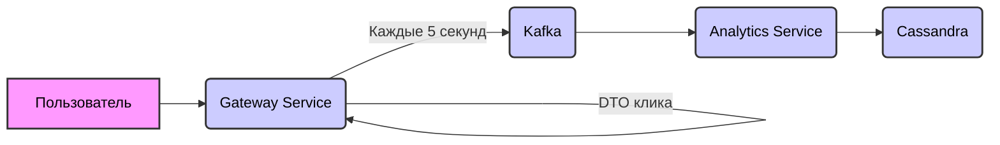

# ClickerSpring 🚀

[](https://java.com)
[](https://spring.io/projects/spring-boot)
[](https://docker.com)
[](https://kafka.apache.org)

**ClickerSpring** — это высоконагруженный кликер с современной архитектурой, где ваши клики эффективно обрабатываются с использованием реактивных технологий и микросервисов.

 *(Пример скриншота интерфейса)*

## 🌟 Особенности

- **Реактивная архитектура** (WebFlux, Reactive Cassandra)
- **Оптимизированная обработка кликов** (батчинг через Kafka)
- **Микросервисная структура** (Gateway + Analytics)
- **Простое развертывание** (Docker Compose "one-command")
- **Масштабируемость** (отдельные сервисы можно масштабировать независимо)

## � Архитектура



## 🛠 Технологический стек

| Компонент         | Технология                          |
|--------------------|-------------------------------------|
| Backend           | Spring Boot 3 (WebFlux, MVC)        |
| База данных       | Cassandra (Reactive Driver)         |
| Брокер сообщений  | Apache Kafka                        |
| Оркестрация       | Docker + Compose                    |
| Аутентификация   | OAuth2 (в разработке)               |

## 🚀 Быстрый старт

Убедитесь, что у вас установлено:

*   Docker 24.0+
*   Docker Compose 2.20+

Запустите все сервисы одной командой:

```sh
docker-compose up --build
```
Система автоматически:

*   Соберет все образы
*   Поднимет Kafka и Cassandra
*   Создаст keyspace в Cassandra
*   Запустит все микросервисы
*   Откройте в браузере:

[http://localhost:8080](http://localhost:8080)

## Схема работы системы сбора и аналитики кликов

Данная схема описывает систему сбора и аналитики кликов, включающую Gateway Service, Kafka и Analytics Service.

**1. Пользовательский клик:**

*   Пользователь взаимодействует с интерфейсом, кликая на определенные элементы.

**2. Gateway Service:**

*   При каждом клике, Gateway Service получает DTO (Data Transfer Object), содержащий информацию о клике (например, ID пользователя, время клика, ID элемента).
*   Gateway Service аккумулирует полученные DTO кликов.

**3. Kafka (Брокер сообщений):**

*   Каждые 5 секунд Gateway Service отправляет накопленные DTO кликов в Kafka в виде сообщений.  Kafka выступает в роли буфера и обеспечивает надежную передачу данных.

**4. Analytics Service:**

*   Analytics Service подписывается на Kafka топик, содержащий сообщения о кликах.
*   Он получает сообщения из Kafka, обрабатывает данные и выполняет необходимые аналитические операции (например, агрегирование статистики кликов по пользователям, элементам, времени).
*   Обработанные данные сохраняются в Cassandra, NoSQL базе данных, подходящей для хранения больших объемов данных и быстрого доступа к аналитической информации.

**Диаграмма:**



# Планы Развития

Ниже представлен список будущих улучшений и нововведений, над которыми мы сейчас работаем.

## Основные Направления Развития

| Направление                                  | Описание                                                                                                 | Статус      |
| -------------------------------------------- | -------------------------------------------------------------------------------------------------------- | ----------- |
| **Топ Игроков** (Личный и Глобальный)       | Реализация списков лучших игроков как в личном масштабе (друзья, клан), так и в глобальном рейтинге.   | В разработке |
| **OAuth2 Аутентификация**                    | Внедрение OAuth2 для более безопасной и удобной аутентификации пользователей.                               | Запланировано |
| **Глобальные Ивенты (Соревнования)**          | Разработка системы глобальных ивентов и соревнований для поддержания вовлеченности игроков.             | Запланировано |

**Пояснения:**

*   **В разработке:**  Функциональность находится в активной фазе разработки.
*   **Запланировано:** Реализация функциональности запланирована в ближайшем будущем.


## ⁉ FAQ

**Q: Почему используется батчинг кликов?**

**A:** Для снижения нагрузки на БД и увеличения производительности.

💡 **Совет:** Для разработки можно запускать отдельные сервисы через IDE, предварительно подняв инфраструктуру:

```bash
docker-compose up (-d)
```
# Grafana: Мощная платформа для мониторинга и визуализации данных

Наш проект использует Grafana, передовую платформу визуализации данных, для создания настраиваемых панелей мониторинга и всестороннего анализа производительности.  Grafana интегрирована с Prometheus, обеспечивая эффективный мониторинг и детальный анализ ключевых метрик.

## Ключевые возможности интеграции Grafana:

*   **Интеграция с Prometheus:** Grafana получает данные напрямую из Prometheus, используя его мощный язык запросов PromQL. Это обеспечивает доступ к обширному набору метрик, собираемых и обрабатываемых Prometheus.

*   **Визуализация ключевых метрик:**  Grafana позволяет создавать настраиваемые панели мониторинга, отображающие жизненно важные метрики производительности:

    *   **Время ответа (Response Time):** Отслеживайте время ответа на запросы, чтобы оперативно выявлять узкие места и оптимизировать производительность.
    *   **Частота запросов (Requests Per Second):**  Мониторьте интенсивность входящих запросов, оценивая нагрузку на систему.
    *   **Количество ошибок (Error Rate):**  Анализируйте ошибки, возникающие в процессе обработки запросов, для быстрой диагностики и устранения проблем.
    *   **Загрузка CPU и памяти:**  Контролируйте использование ресурсов сервером,  оптимизируя выделение ресурсов и предотвращая перегрузки.
    *   **Задержки в сети:**  Диагностируйте проблемы с сетевым взаимодействием между компонентами приложения.

*   **Traceability (Трассировка запросов):** Grafana позволяет отслеживать весь жизненный цикл запроса (trace) через различные компоненты системы,  предоставляя детальную информацию о времени выполнения каждого этапа.  Это помогает выявлять причины задержек и оптимизировать взаимодействие между сервисами,  что критически важно для понимания архитектуры приложения.

*   **Кастомизация и Алертинг (Настройка и оповещения):**  Гибкие настройки Grafana позволяют создавать собственные панели мониторинга, адаптированные к конкретным потребностям проекта.  Настраивайте оповещения (Alerting) для мгновенной реакции на критические изменения в работе системы.

*   **Доступ через Web-интерфейс:**  Grafana доступна через веб-интерфейс по адресу `localhost:3000`. Интуитивно понятный интерфейс позволяет легко создавать и редактировать панели мониторинга, а также делиться ими с другими членами команды.

*   **Централизованный мониторинг:**  Grafana обеспечивает единую точку доступа ко всей информации о состоянии системы, упрощая мониторинг и анализ данных.

## Преимущества использования Grafana в нашем проекте:

*   **Улучшенная наблюдаемость:** Grafana предоставляет глубокое понимание работы приложения благодаря наглядной визуализации ключевых метрик и трассировке запросов.

*   **Быстрое выявление проблем:**  Алерты и настраиваемые панели мониторинга позволяют оперативно выявлять и устранять проблемы, минимизируя время простоя и обеспечивая стабильность работы.


# [Cosmic Clicker]

Developed with ❤️ by [OptimusMac] | 2023

---
